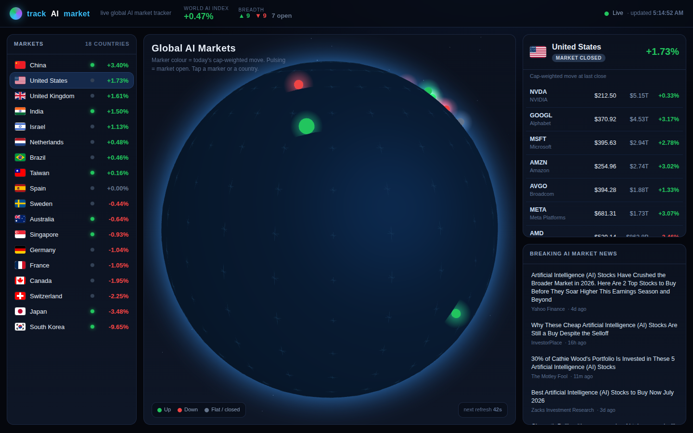
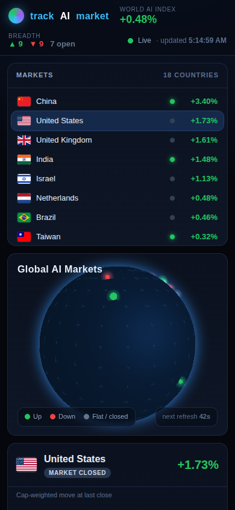

# trackAImarket 🌐

**A live 3D globe that tracks the world's top AI companies** — streaming real
prices across 18 markets, a **market-cap-weighted** up/down trend for each
country, and a breaking AI-market news feed.



<p align="center">
  
</p>

---

## Table of contents

- [What it does](#what-it-does)
- [Why this version is actually live](#why-this-version-is-actually-live-the-fix)
- [How it works](#how-it-works)
- [Project layout](#project-layout)
- [Deploy it free](#deploy-it-free)
- [Local development](#local-development)
- [Configuration](#configuration)
- [Data sources & disclaimer](#data-sources--disclaimer)

---

## What it does

| Feature | Detail |
| --- | --- |
| 🌍 **3D globe** | A Three.js globe with one glowing marker per country. Marker **colour = today's cap-weighted move** (green up / red down); markers **pulse while that market is open**. Drag to rotate, tap a marker or a country. |
| 📈 **Live prices** | ~180 AI companies across 18 countries, refreshed every **~45 seconds** with a visible countdown. |
| ⚖️ **Cap-weighted trends** | Each country's index is weighted by market cap, so the big players move it more (caps normalised to USD for consistency). |
| 🕒 **Market-hours aware** | Closed exchanges are labelled `MARKET CLOSED` and show their **last-close** move instead of faking a live stream. |
| 📰 **Breaking news** | A global AI-market headline feed (Google News), refreshed every 5 minutes. |
| 📱 **Responsive** | A lighter globe + stacked layout on phones. |
| 🛟 **Graceful fallback** | If a device can't run WebGL (or the Three.js CDN is blocked), the globe hides itself and the live data / country list / news keep working. |

## Why this version is actually live (the fix)

The original build fetched Yahoo Finance **directly from the browser** through
free public CORS proxies. Those proxies constantly failed, so the app silently
fell back to a random-walk **simulation** — its own badge literally read
*"Real-time simulation."* That's why the data looked static and fake.

This version moves the data fetching to a tiny server-side **helper** (two
serverless functions), so the numbers are real:

```
Before ❌   browser ──▶ public CORS proxy ──▶ Yahoo   (flaky ⇒ falls back to fake simulation)
After  ✅   browser ──▶ /api/quotes (our server) ──▶ Yahoo   (auth + batched + edge-cached ⇒ real)
```

The helper:

1. calls Yahoo Finance **server-side** (no CORS, proper cookie + crumb auth),
2. **batches** all ~180 symbols into a couple of requests,
3. is **cached at the CDN edge** (`s-maxage`) so Yahoo is never hammered even
   with many visitors, and
4. returns real **price / % change / market cap / market state** per symbol.

**No API key required.** It's free / best-effort: if a symbol or the feed is
briefly unavailable, it falls back to the last good value.

## How it works

```
                 ┌──────────────────────────────┐
                 │  index.html + app.js         │
   Browser  ◀────│  • 3D globe (Three.js/CDN)   │
                 │  • country list + detail     │
                 │  • news panel                │
                 └───────┬───────────────┬──────┘
                         │ /api/quotes   │ /api/news
                         ▼               ▼
                 ┌───────────────┐ ┌───────────────┐
                 │ Yahoo Finance │ │  Google News  │
                 │ (v7 quote)    │ │  (RSS)        │
                 └───────────────┘ └───────────────┘
```

- **`/api/quotes`** returns `{ SYM: { price, changePct, cap, state, cur, name } }`.
  `state === "REGULAR"` means the market is open; `cap` drives the cap-weighting.
- **`/api/news`** returns `{ items: [{ title, source, url, time }] }`.
- The frontend computes each country's trend as
  `Σ(changePct × capUSD) / Σ(capUSD)` and colours the globe marker accordingly.

## Project layout

```
index.html        Static frontend (globe + UI). The company dataset is embedded inline.
app.js            Frontend logic — loads Three.js from a pinned CDN, polls the /api helpers.
api/quotes.js     Serverless: Yahoo Finance quotes (cookie+crumb auth, batched, edge-cached 45s).
api/news.js       Serverless: Google News RSS → JSON (edge-cached 5m).
vercel.json       Serverless function config.
docs/             Screenshots used in this README.
```

## Deploy it free

### Vercel (recommended — static site + `/api` functions, zero config)

**Dashboard:** import the repo at <https://vercel.com/new> → **Deploy**. Done.

**CLI:**
```bash
npm i -g vercel
vercel --prod      # logs in via browser, gives you https://<name>.vercel.app
```

### Custom domain
Once you own `trackAImarket.com`, add it under the project's **Domains**
settings. Until then the free `*.vercel.app` URL works fine.

### Netlify
The static frontend works as-is. The `/api` helpers are written for Vercel's
Node handler signature, so to run them on Netlify move them to
`netlify/functions/` and adapt the handler (`exports.handler = async (event) => …`).

## Local development

`vercel dev` runs the static site and both `/api` functions together at
<http://localhost:3000>.

## Configuration

- **Refresh cadence** — `REFRESH_MS` in `app.js` (default 45 000 ms).
- **Tracked companies** — the `window.COUNTRIES` array inline in `index.html`:

  ```js
  { id:"us", name:"United States", code:"US", lat:39.8283, lon:-98.5795,
    companies:[ { n:"NVIDIA", s:"NVDA", p:142.3, ch:2.34 }, /* … */ ] }
  ```

  `s` is the **Yahoo Finance symbol** — international tickers need their exchange
  suffix (e.g. `2330.TW`, `ASML.AS`, `005930.KS`, `9984.T`). `p`/`ch` are seed
  values for the very first paint and are replaced by live data on load.
- **FX weighting table** — `FX` in `app.js` (approximate rates, used only to
  normalise market caps for weighting, never for display).

## Data sources & disclaimer

Prices come best-effort from public **Yahoo Finance** endpoints and news from
**Google News**; both may be delayed or occasionally unavailable. This project
is for information and demonstration only — **not investment advice**.
