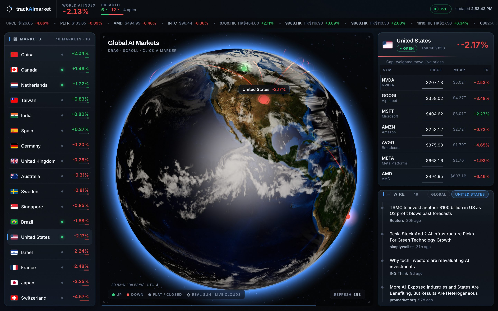
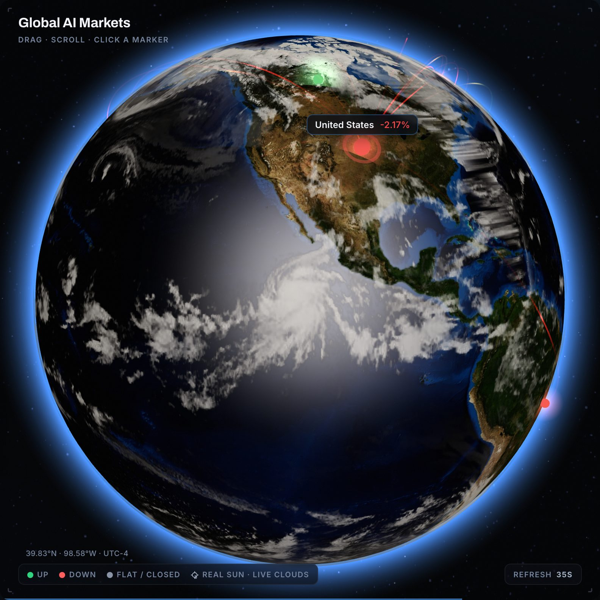
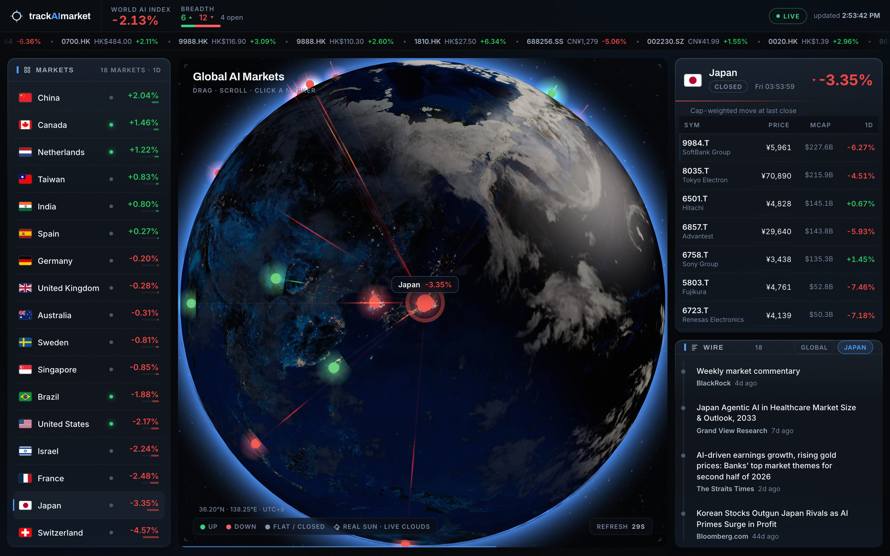
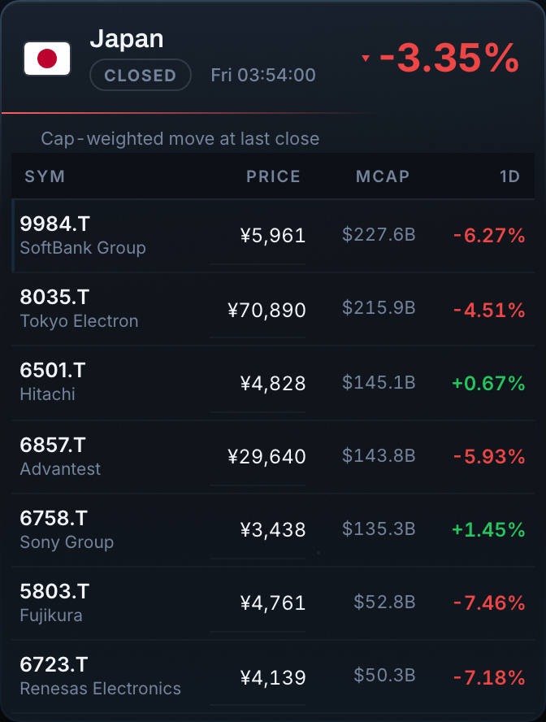
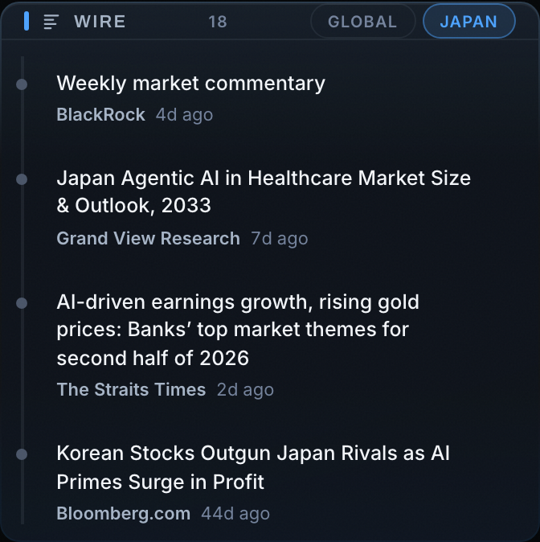
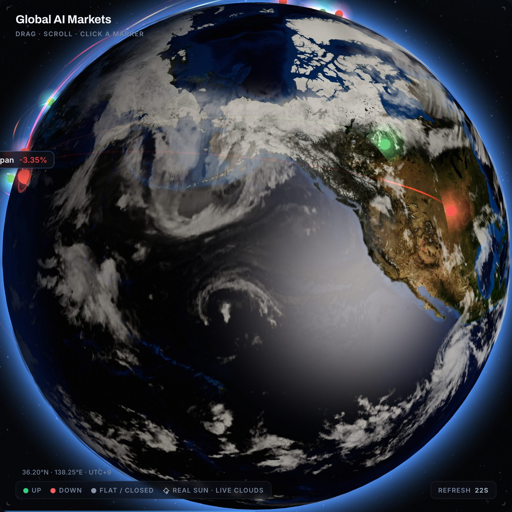
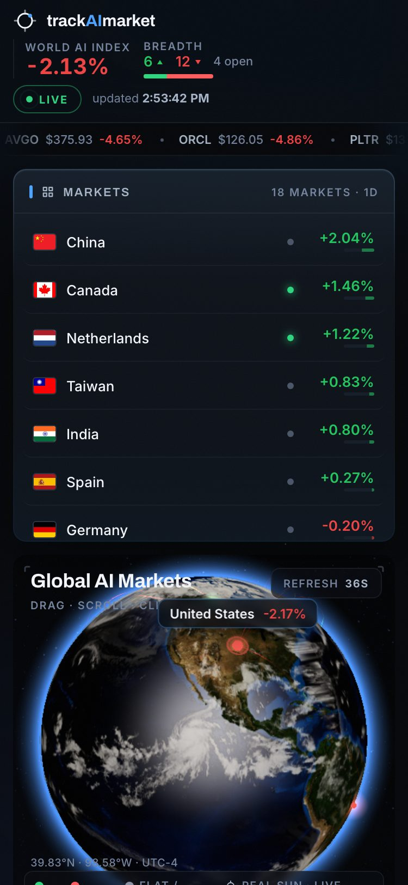

# trackAImarket 🌐

**A live, photoreal 3D Earth that tracks the world's top AI companies.**
~180 AI stocks across 18 markets stream through a tiny serverless proxy onto a
Blue-Marble globe with a **real day/night terminator** (night side lit by city
lights, computed from the actual position of the sun right now), **live cloud
cover** from EUMETSAT satellite data refreshed every ~3 hours, and **animated
market arcs** linking the selected exchange to every other market. Around it: a
mission-control dashboard — cap-weighted country trends, a World AI Index with
session sparkline, a 180-ticker tape, per-row price sparklines, live exchange
clocks, and a news wire that follows whichever country you select.

No build step, no API keys, no dependencies — one HTML file, a handful of ES
modules, and two Vercel functions.

---

## Live walkthrough

Every screenshot below was captured by [`scripts/capture.mjs`](scripts/capture.mjs)
driving the real running app with Playwright — live Yahoo Finance quotes, live
Google News headlines, real WebGL output.

**1 — The dashboard, seconds after load.** Quotes for all 180 symbols have
arrived (LIVE pill, top right) and scroll through the ticker tape; the World AI
Index (with session sparkline) and breadth micro-bar are computed cap-weighted
in USD; the US is selected — ping ring, label, coordinates readout, and arcs
reaching out to every other market. The clouds are today's real weather:



**2 — The globe up close.** NASA Blue Marble day map, bump-mapped terrain,
ocean specular, an atmosphere rim — and **live EUMETSAT cloud cover** (that
tropical storm is really out there right now). Marker colour = that country's
cap-weighted move today; the reticle brackets and 2px countdown bar frame the
viewport like an instrument:



**3 — Click Japan in the list → the camera flies there** and the arcs re-home
to Tokyo. It's the middle of the night in Japan, so it sits on the **night
side, lit by real city lights**, its exchange chip flips to CLOSED with the
local clock reading ~1 AM — and the news wire switches itself to Japanese
AI-market headlines:



**4 — The country detail panel** for that selection: per-company live price in
local currency, market cap normalised to USD, and today's move — sorted by cap.
Prices that just ticked carry a decaying underline (terminal-style update
trace), and once enough refreshes accumulate each row grows a session
sparkline:



**5 — The Wire.** Google News headlines on a timeline rail, refreshed every
5 minutes — **scoped to the selected country** (with a Global tab to pin the
world feed). Items younger than 15 minutes get an accent node; younger than
5 minutes, a NEW badge:



**6 — Drag to rotate** (the click-vs-drag detector keeps the selection stable
while you spin; hovering any marker shows a name + trend tooltip and clicking
selects it — with occlusion-aware picking, markers behind the planet can't be
clicked):



**7 — Mobile.** The layout stacks, the ticker stays, the camera auto-fits the
globe to the narrower panel, and touch drag/pinch work:

<p align="center">
  
</p>

## How it works

```
                 ┌────────────────────────────────────┐
                 │ index.html · app.js · globe.js     │
   Browser  ◀────│  • photoreal three.js Earth        │
                 │  • lib/market.mjs (pure math)       │
                 │  • country list · detail · news    │
                 └───────┬────────────────────┬───────┘
                         │ /api/quotes        │ /api/news
                         ▼                    ▼
                 ┌────────────────┐   ┌───────────────┐
                 │ Yahoo Finance  │   │  Google News  │
                 │ (v7 quote API) │   │     (RSS)     │
                 └────────────────┘   └───────────────┘
```

- **`/api/quotes`** calls Yahoo server-side (cookie + crumb auth, symbols
  batched 50 at a time), normalises minor-unit currencies, and is edge-cached
  45 s (`s-maxage`) so Yahoo is never hammered no matter how many visitors.
  Returns `{ SYM: { price, changePct, cap, state, cur, name } }` —
  `state === "REGULAR"` means the market is open.
- **`/api/news`** turns a Google News RSS query into clean JSON, edge-cached 5 min.
- The frontend computes each country's trend as
  `Σ(changePct × capUSD) / Σ(capUSD)` (see [`lib/market.mjs`](lib/market.mjs))
  and colours the globe markers accordingly. Both endpoints degrade to their
  last good snapshot rather than failing.

## Technical deep-dive

**The day/night terminator is real.** [`lib/market.mjs`](lib/market.mjs) computes
the subsolar point from the current UTC time (solar declination + hour angle —
we skip the equation of time, whose ±4° error is invisible at globe scale). A
directional "sun" light follows that point, and a fragment-shader patch
injected via `onBeforeCompile` into three.js's stock Phong material blends
NASA's night-lights map in wherever `dot(normal, sunDir)` says the sun is below
the horizon. You get physically-correct dusk across the planet — and a neat
market-hours tie-in: exchanges are open roughly where the globe is lit. Using
`onBeforeCompile` (rather than a from-scratch `ShaderMaterial`) keeps the
entire built-in lighting/bump/specular pipeline for free; the alternative —
rewriting Phong shading by hand — is where most custom-globe projects go wrong.

**Picking had to be occlusion-aware.** A naive `raycaster.intersectObjects(markers)`
happily selects markers on the far side of the planet, and a `pointerdown`
handler fires when the user meant to drag. The fix: raycast against the earth
mesh *plus* invisible 3.4×-larger hit spheres and take the nearest hit, and
only treat pointer-up as a click if the pointer moved < 7 px in < 600 ms.
Camera fly-to is a quaternion slerp around the globe (never through it), and
everything respects `prefers-reduced-motion`.

**Currencies lie.** Yahoo quotes London in **pence** (GBp) and Tel Aviv in
**agorot** (ILA) — but reports market caps for the same listings in pounds and
shekels. The previous build missed this, so UK stocks were weighted ~128× too
heavily in the World AI Index and displayed at 100× their price. The proxy now
normalises minor units server-side (verified against live responses; see
`MINOR_UNIT` in [`lib/yahoo.cjs`](lib/yahoo.cjs) and the regression tests).

**The clouds are real.** The cloud layer isn't a static texture: it's Matt
Eason's EUMETSAT-derived live composite (`clouds.matteason.co.uk`, refreshed
~3-hourly, re-fetched every 2h by long-lived tabs). The raw mosaic is IR-derived
— thin haze and satellite-seam streaks live in the mid-grays, and the poles are
no-coverage fill that would render as fake ice caps. Before texturing, the
image passes through a canvas pipeline: vertical median-of-3 (kills scan-line
streaks), a geostationary-coverage polar fade (±70° lat), and a levels curve
(floor cut + gamma) so only genuine cloud structure survives as alpha. Each
step was tuned against the real downloaded image, and the whole thing degrades
to a static NASA cloud texture if the live host is unreachable.

**Arcs without a particle library.** Selecting a market rebuilds 17 cubic-Bézier
great-circle tubes (control points lifted along the chord, higher for longer
hops) with a ~40-line custom shader: colour is a gradient from the source
market's trend to each destination's, a pulse travels the length on a per-arc
phase offset, and a draw-in uniform sweeps them out of the selected marker.
Geometry and materials are explicitly disposed on every rebuild, and arcs
opt out of raycasting so they never steal clicks from markers.

**Country news that's actually about the country.** `/api/news?q=Japan` builds
a Google News query from a template chosen empirically — `"{country}" AI market
OR technology earnings` beat two alternates across Japan/Korea/Israel/NL test
feeds (the quoted country name defeats name collisions and generic wire
reprints). Topics are cached independently server-side (bounded LRU-ish map)
and client-side, and the tab UI follows your selection with a Global pin.

**Zero-dependency by design.** three.js loads from a pinned CDN via an import
map whose SHA-256 hash is allow-listed in the CSP (`vercel.json`); textures
stream progressively so first paint is instant and a blocked CDN degrades to a
stylised sphere — the data panels never depend on WebGL at all.

## Project layout

```
index.html           Markup + styles. No inline data, one hashed import map.
data.js              The 18-country / 180-company dataset (+ seed quotes).
app.js               UI logic: polling, panels, list, news (XSS-safe DOM building).
globe.js             The photoreal interactive Earth (three.js).
lib/market.mjs        Pure market math (weighting, formatting, sun position).
lib/yahoo.cjs        Yahoo quote shaping + minor-unit currency normalisation.
lib/rss.cjs          Google News RSS parsing.
api/quotes.js        Serverless: batched, cached, authed Yahoo proxy.
api/news.js          Serverless: RSS → JSON.
scripts/dev.mjs      Zero-dependency local dev server (static + /api + prod headers).
scripts/capture.mjs  Playwright E2E golden path + README screenshots.
scripts/update-seeds.mjs  Re-anchor the seed quotes in data.js to live prices.
tests/               node:test unit tests for all pure modules.
vercel.json          Function config + CSP/security headers.
```

## Install + run

Requires Node ≥ 20. No packages needed to run:

```bash
git clone https://github.com/rayancheca/LiAiGlobeTracker.git
cd LiAiGlobeTracker
npm run dev          # → http://localhost:3000  (static site + both /api functions)
```

Tests (pure-module unit tests, no dependencies):

```bash
npm test
```

E2E + regenerate the README screenshots (the only thing that needs a package):

```bash
npm i --no-save playwright && npx playwright install chromium   # one-off
node scripts/capture.mjs                # runs the golden path against :3000
```

`vercel dev` also works if you prefer parity with the platform.

## Deploy

**Vercel (zero config):** import the repo at <https://vercel.com/new> → Deploy.
Every push to `main` redeploys. The static frontend, both `/api` functions,
edge caching and the security headers in `vercel.json` all apply automatically.

**Netlify:** the frontend works as-is; move the two functions to
`netlify/functions/` and adapt the handler signature.

## Configuration

- **Refresh cadence** — `REFRESH_MS` in [`app.js`](app.js) (default 45 000 ms).
- **Tracked companies** — [`data.js`](data.js). `s` is the Yahoo symbol
  (international tickers need their exchange suffix, e.g. `2330.TW`, `ASML.AS`);
  `p`/`ch` are first-paint seeds — refresh them any time with
  `node scripts/update-seeds.mjs`.
- **FX weighting table** — `FX` in [`lib/market.mjs`](lib/market.mjs). Approximate
  rates used only to normalise caps to USD for weighting, never for display.
- **Textures** — `TEX` in [`globe.js`](globe.js) (pinned CDN URLs + the live
  cloud source; swap for self-hosted files if you prefer). The live cloud host
  must also be allow-listed in the CSP (`vercel.json`).
- **News scoping** — the per-country query template lives in
  [`lib/rss.cjs`](lib/rss.cjs) (`newsQuery`).

## Data sources & disclaimer

Prices come best-effort from public **Yahoo Finance** endpoints and news from
**Google News**; both may be delayed or occasionally unavailable. This project
is for information and demonstration only — **not investment advice**.
